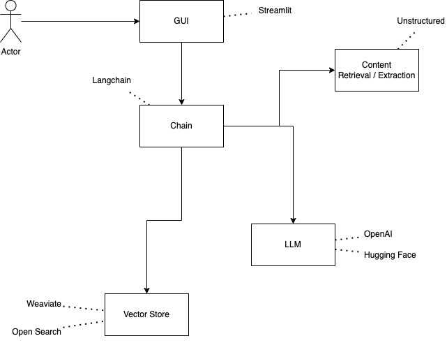

# art-of-questions
Repository containing required resources for our workshop titled: The Art of Questions, creating a QA system using semantic search and LLMs

## Setup the repository
First setup your python environment, all the code is tested with Python 3.11.* but we expect the code to work with >3.8.1. We advise using python virtual environment or a tool like conda. If you are not familiar with virtual environments, this link should get you all up to speed.
[Creating and using virtual environments with Python](https://realpython.com/python-virtual-environments-a-primer/)

If you have done it before, but always forget the exact commands, you can find them below.

```bash
python3 -m venv .venv
source .venv/bin/activate
python -m pip install -r requirements.txt

# When you are done
deactivate
```

And for windows the following commands should do the trick

```Powershell
python -m venv .venv
.venv\Scripts\activate
python -m pip install -r requirements.txt

deactivcate
```
We are integrating with a number of other tools and services. Therefore we need some API keys. You need to create a file with the name _.env_. The repository contains a template for the file _template-env_. After creating the file, you do not need all the API keys yet, you can run the python file that verifies correct _.env_ file.

```bash
python run_environment_check.py
```

The output should be something like the following

```text
Please set the key WEAVIATE_API_KEY in the .env file if you want to work with Weaviate

Overview of all found and missing environment variables:
found  - OPENAI_API_KEY
found  - HUGGINGFACEHUB_API_TOKEN
ERROR  - WEAVIATE_API_KEY
```

If you know the services you want to use, you can obtain those API keys. If you are not sure, you can registere those keys later on.

## OVerview of what you are going to do


